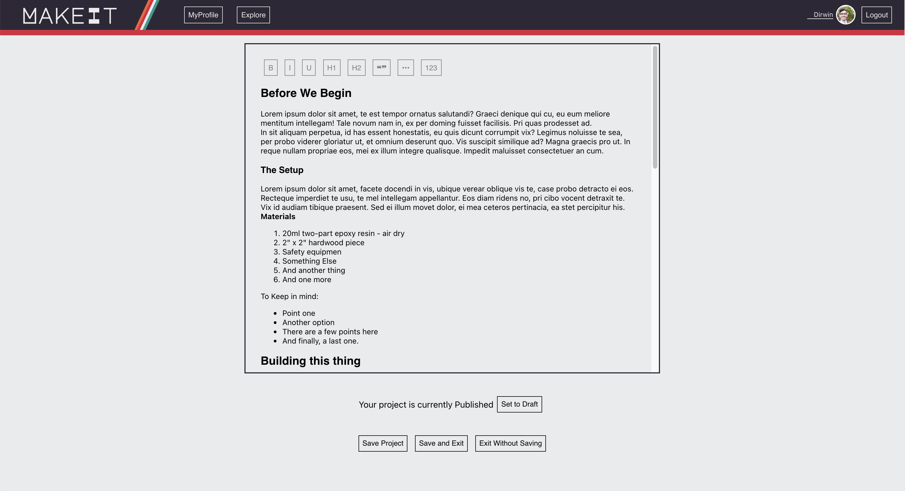

# MakeIt

[You can play demo MakeIt right now!](https://makeit-e985d.web.app/)

Learn - Teach - Make

[Here is the backend for this project](https://github.com/dannyirwin/makeit-backend)

## Summary

MakeIt is a tutorial and project publishing site for makers and craftspeople.
Makers write tutorials, search for makers and projects, and engage with their
maker community. MakeIt makes it easy to author projects withy easy to use
text-editing tools and image uploading.

This project was made over 2 weeks as a Capstone project during my coding
bootcamp.

## Screenshots

Login page 

An example of a published Project 

 

Take a look at the Project Editor 

## Technologies

Frontend

- React
- Redux

Backend

- Node
- Express
- Knex
- Objection
- PostgreSQL

Deployed

- Image hosting: Firebase
- Frontend: Firebase
- Backend: Heroku

## Features

- User Authorization
- Users can Follow other users
- Users can bookmark other projects
- Users can search for both users and projects
- Users can write, save, and publish Projects
- Project editor has dynamic and easy to use text-editing tools
- Images can be added to projects by uploading files or using external Urls
- Projects can be saved as drafts of published
- Published projects display images and project content in a professional
  looking layout.
- Published projects will show up in searches
- User can customize their photo and about me to appear in searches

## Reach out

#### Want to get get in touch or see more of my work?

[Github Homepage](https://github.com/dannyirwin)

[Email Me](https://github.com/dannyirwin)

[Linkedin](https://www.linkedin.com/in/itsdanielirwin/)
